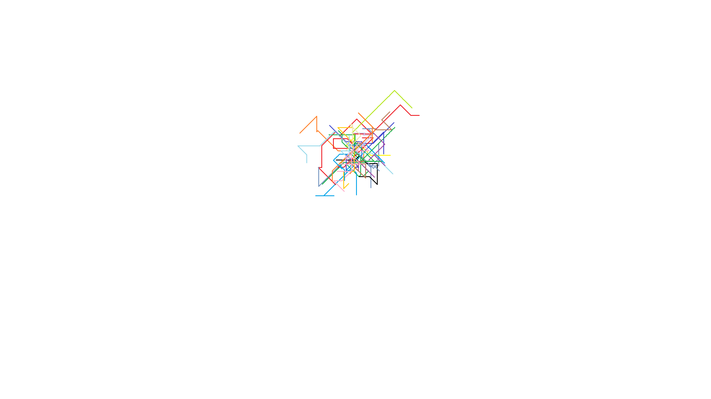

# Fun-Stuff
Collection of programs (*largely written in python*) that do mysterious, novel, or even strange things. 
Their usefulness is *debatable* so uhhh enter at your own risk...
___
## \#1. Code Artist (*Python*) -
WIP python (vers. 3.11) script that pseudorandomly-generates artwork in MS Paint (*See REQUIREMENTS inside for details*)

## \#2. formulas_.ipynb (*Jupyter Notebook/LaTeX*)
A collection of various beautiful/aesthetically-pleasing Math formulas and symbols displayed using the jupyter notebooks' built-in markdown LaTeX compatibility
For some reason GitHub has trouble displaying this properly >:|

## \#3.
